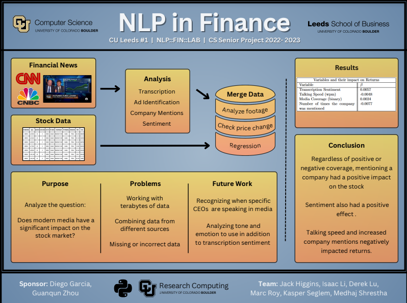

Create the pages of your website/Digital Portfolio.  Your portfolio should include a navigation bar with the following pages: 
“Welcome / About Me” page
“Resume/CV” page
“Highlights of Interests/Extracurricular” page,
“Highlights-Academic/Projects/Working” page,
“Social Media” page.

Homepage that is a Welcome / About Me Page
full paragraph, 250 words or more  
“Inviting and warm” welcome message
Narrative of who you are / what makes you unique 
Purpose of the digital portfolio with rationale
Explanation of what visitors will find on the portfolio 

# Welcome

Where I am from and where I have studied - Seattle, CU
What I am interested in - data science, software development, etc.
Jobs I look for - small company, humanitarian, in person

My name is Jack Higgins. I am a graduating senior who studied computer science at the University of Colorado Boulder. I have an interest in software development and data science that I have pursued through my classes at CU. I grew up in the greater Seattle area and graduated from Issaquah High School in 2019. I am graduating in the spring of 2023 with a bachelors degree in Computer Science from the school of engineering and a business minor.

Currently, I am looking for job opportunities in either the software development or data science field to grow in my professional life. I have developed a passion for data science, specifically looking at the applications of machine learning in the field to solve humanitarian issues.

  

  

# Resume

[Click here to view my resume](https://drive.google.com/file/d/1e6CnZcqW8teMI4kFj8aAPcAoCkuL4jH-/view?usp=sharing)

# Extracurricular Interests

### Rock Climbing / Bouldering
I picked up rock climbing in late 2022 and have been going to a climbing gym consistently since then. My friends at CU have been climbing for nearly their entire lives so they have been able to teach me some tricks.

### Tennis
When I have gone back to Seattle for the summers I spend my free time playing tennis with friends and family. Can't say I am great, but would love to play consistently when I am out of university.

### Skiing

A big part of why I came to Colorado was to get to ski on weekends. Coming from the Cascades to the Rockies was a great shift in quality and I have had a blast skiing Eldora, Copper, and Winter Park while I have been at CU.

Highlights of your interests or extracurricular activities you are involved with (special things that distinguish you from others charity work, community service, etc.)
At least 3 highlights with pictures
At least 50 words per description 

# Academic Acheivements

Highlights of your academic, projects, or working career 
At least 3 projects/highlights with pictures/links  
At least 50 words per description 

Mostly put coursework and descriptions of classes
Principles of programming, object oriented programming, and advanced data science

### Capstone - NLP in Finance

  

The goal of this project was to develop a model to show the effect of cable news on a stock price. We scraped Internet Archive for years worth of data from CNBC, CNN, Fox Business, and MSNBC. We cleaned the shows by using music identification from pyAudioAnalysis to isolate the shows. From this data we used Whisper to get an accurate transcript of what was said. We pulled stock data from the past 10 years to test with. We identified when companies were spoken about and used OLS regression to create a model. 

# Social Media
Include your LinkedIn profile link 
At least two additional links social media profiles (2 additional)
Make sure they are public and the links work
For all of your links to your social media profiles: Include a minimum 25 word explanation of how it supports your personal brand and what type of content visitors will find relevant. 

[LinkedIn](https://www.linkedin.com/in/jack-higgins-5bba08209/)
[Twitter](https://twitter.com/JackHig94240836)
